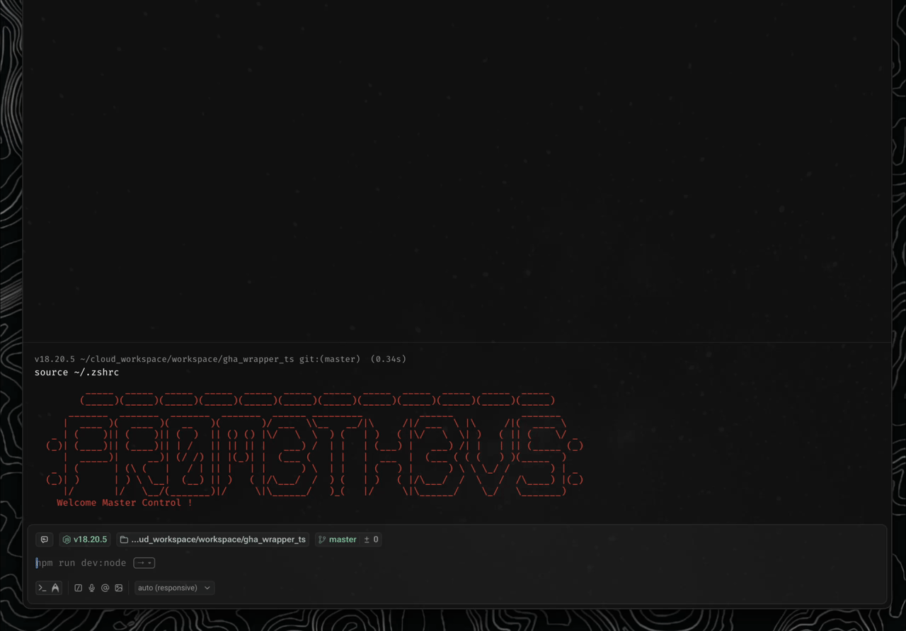
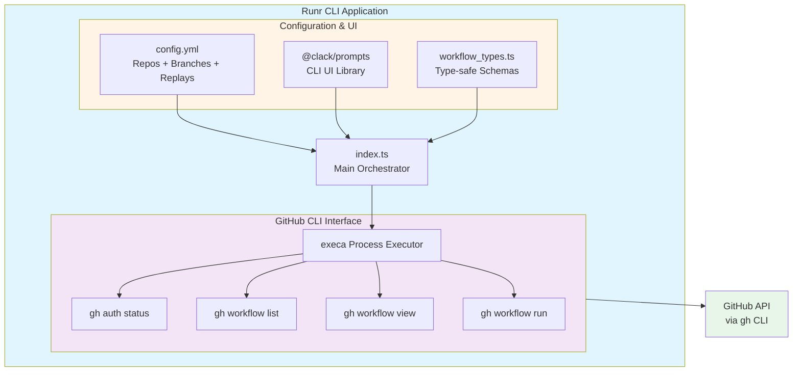

# Runr

The following sections provides a "Getting Up to Speed" overview, designed to be completed in approximately 15 minutes.

> [!IMPORTANT]
> 
> RTM - Read The Manual
>
> For comprehensive and detailed documentation, please consult the project wiki. [Under Construction]

---

## 📋 0. Overview

**Purpose:** A TypeScript CLI tool that provides an interactive wrapper for GitHub Actions workflow dispatch, simplifying the process of triggering workflows across multiple repositories.

**What it does:** Runr streamlines the GitHub Actions workflow dispatch process by providing an interactive CLI interface. Users can select repositories, branches, and workflows from a configured list, then dynamically populate workflow inputs based on the selected branch's workflow schema. It validates authentication, displays the generated command for confirmation, and optionally opens the workflow (at the selected ref) in the browser after execution.

**Problem Solved:** Manually dispatching GitHub Actions workflows requires navigating the GitHub UI or constructing complex CLI commands with multiple input flags. This tool eliminates the friction of remembering repository names, branch configurations, and workflow input schemas by providing a guided, interactive experience.

**Key Benefits:**
- **Interactive Selection**: Choose repos, branches, and workflows from pre-configured lists
- **Dynamic Input Handling**: Automatically detects and prompts for all workflow input types (string, number, boolean, choice, environment)
- **Workflow Replays**: Save complex workflow configurations as "replays" to re-run them instantly without re-entering inputs
- **Command Confirmation**: Preview the generated `gh workflow run` command before execution
- **Quick Browser Access**: Option to open the workflow run in GitHub's web UI immediately after dispatch

**Functions:**

- **Authentication Check**: Validates GitHub CLI login status before proceeding
- **Repository Management**: Reads YAML config from standard system paths (XDG, ~/.config, etc.)
- **Replay System**: Persistence layer to save, list, and execute frequently used workflow runs
- **Workflow Discovery**: Lists active workflows from selected repository via GitHub CLI
- **Input Schema Parsing**: Extracts and types `workflow_dispatch` inputs from the selected branch's workflow YAML
- **Interactive Prompts**: Provides text, select, and confirm prompts for user input
- **Command Execution**: Builds and executes `gh workflow run` with proper arguments
- **Web UI Integration**: Opens workflow view for the selected branch in browser on demand

---

### Table of Contents

- [0. Overview](#-0-overview)
- [1. Architecture & Business Context](#️-1-architecture--business-context)
- [2. Getting Started (15-Minute Path)](#-2-getting-started-15-minute-path)
- [3. Testing](#-3-testing)
- [4. CI/CD & Deployment](#-4-cicd--deployment)
- [5. Contributing](#-5-contributing)
- [License](#-license)

---

## 🏗️ 1. Architecture & Business Context

### Business Context

Runr serves developers and DevOps engineers who frequently trigger GitHub Actions workflow dispatch. It reduces context-switching between the terminal and browser, decreases errors from manual command construction, and standardizes workflow execution across teams.

### Architectural Context

This is a cross-runtime TypeScript CLI application that orchestrates GitHub CLI (`gh`) commands through interactive prompts. It operates as a local tool with no backend services.

**Quick Usage Demo:**



**Architecture Diagram:**



#### Technology Stack

**Languages:**
- TypeScript 5.9.3

**Frameworks & Libraries:**
- `@clack/prompts` ^0.11.0 - Beautiful CLI prompts (intro, outro, select, text, confirm, spinner)
- `execa` ^9.6.1 - Process execution with template literal support
- `yaml` ^2.8.2 - Cross-runtime YAML parsing

**Infrastructure:**
- Runtime: Bun (primary) / Node.js (alternative) - fully cross-runtime compatible
- Deployment: Local CLI tool (no cloud infrastructure)
- Database: N/A (file-based YAML configuration)

---

## 🚀 2. Getting Started (15-Minute Path)

### Prerequisites

**Required Access:**
- GitHub account with access to target repositories
- GitHub CLI authenticated (`gh auth login`)

**Required Software:**
- [Bun](https://bun.sh) version 1.0.0 or higher (recommended)
- OR [Node.js](https://nodejs.org) version 18.0.0 or higher with `ts-node`
- [GitHub CLI (`gh`)](https://cli.github.com/) version 2.0.0 or higher
- IDE recommendation: VS Code with TypeScript extensions

### Project Structure

```
runr/
├── index.ts              # Main CLI application entry point
├── workflow_types.ts     # TypeScript type definitions for GitHub workflow schemas
├── config.yml            # User configuration (repos + branches) - gitignored
├── config.yml.example    # Example configuration template
├── package.json          # Dependencies and scripts
├── tsconfig.json         # TypeScript compiler configuration
├── bun.lock              # Bun package lock file
├── node_modules/         # Installed dependencies
└── dist/                 # Production build artifacts
```

### Installation Steps

```bash
# Step 1: Clone the repository
git clone [repository-url]

# Step 2: Navigate to project directory
cd runr

# Step 3a: Install dependencies (using Bun - recommended)
bun install

# Step 3b (alternative): Install dependencies (using npm)
npm install

# Step 4: Configure your repositories
cp config.yml.example config.yml
```

### Configuration

Runr looks for `config.yml` in the following order:
1. `XDG_CONFIG_HOME/runr/config.yml` (if set)
2. `~/.config/runr/config.yml` (Standard on Linux/Mac)
3. Platform specific defaults (e.g. `%APPDATA%` on Windows, `~/Library/Preferences` on Mac)
4. `./config.yml` (Current directory fallback)

**Example `config.yml`**:
```yaml
repos:
  - name: owner/repo-name
    branches:
      - main
      - develop
# Replays are automatically added here when you save a workflow run
replays: []
```

### Running Locally

```bash
# Run with Bun (recommended - faster startup)
bun run dev:bun

# Run with Node.js + npx + tsx
npm run dev:node

# Build TypeScript to JavaScript
npm run build

# Run built version
npm start

# Install Globally (Local Simulation)
npm link
# Run runr anywhere (via terminal)
runr

# Uninstall Globally (Local Simulation)
npm unlink
```

### Production Build

Uses `tsup` to build the project -- which creates a production-ready version of the application in the `dist` directory
- Single file output
- Minified
- Tree-shaken
- Type-safe
- No node_modules/runtime dependencies required (minus gh cli)

---

## 🧪 3. Testing

### Local Testing

**Unit Tests:**

```bash
npm run test:node
# OR
bun test
```

**Test Coverage:**

```bash
npm run coverage
```

**Integration Tests:**

```bash
# [Integration tests not yet configured]
```

---

## 🔄 4. CI/CD & Deployment

### Pipelines

**Ephemeral/Development:**
- [CI/CD pipelines not yet configured]

**PRODUCTION Deploy:**
- N/A - This is a local CLI tool, not a deployed service

### Deployment Locations

**Availability:** N/A (Local Tool)

**Foundation:**
- Foundations: Local Development Machine
- Environment: Local / N/A
- Type: CLI Tool
- Dashboard: N/A

**Log Levels:**
- Local: Console output via `@clack/prompts` log methods
- How to change: Modify `log.step()`, `log.success()`, `log.error()` calls in `index.ts`

### CI Environment Testing

| Environment        | Purpose                | Jenkins/GHA/CI URL | Prerequisites               |
| ------------------ | ---------------------- | ------------------ | --------------------------- |
| Local              | Development & Usage    | N/A                | Bun/Node.js, gh CLI, config |

**E2E Testing:**
- Location: [Not yet configured]
- Command: `[E2E tests not implemented]`
- Prerequisites: Would require mock GitHub API or test repositories

---

## 🤝 5. Contributing

### Development Workflow

- **Branching Strategy:** [Branching strategy not yet defined]

1. Fork the repository
2. Create a feature branch (`git checkout -b feat/amazing-feature`)
3. Make your changes
4. Run the application locally to test (`bun run dev`)
5. Commit your changes following [Conventional Commits](https://www.conventionalcommits.org/)
6. Push to your branch (`git push origin feat/amazing-feature`)
7. Open a Pull Request to `incoming` branch

### Code Review Guidelines

- **Quality Gate Review:** [Quality gates not yet defined]
- **Code Review - Best Practices:** [Code review guidelines not yet defined]

**Standards:**
- Follow TypeScript strict mode conventions
- Use descriptive variable and function names
- Add JSDoc comments for exported types and functions
- Ensure all workflow input types are properly handled

---
